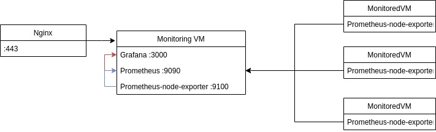

= MonitoringVMDeployment

This repo holds deployment for the Monitoring VM. 
It will set up Grafana, Prometheus, and Prometheus-node-exporter on the machine.

== Grafana

After you log in to grafana via the nginx with basic authentication you can set up the graphs.
By default and easiest way is as follows:

* Select the resource to prometheus
* Prometheus runs on localhost:9100
* Import dashboard ( 11074 ) for the default graphs

== Prometheus

Prometheus monitors the host or other hosts that we specify in the config file.
For monitoring and before deploying change the targets.

== Prometheus-node-exporter

This program makes metrics of the host available on http://host.domain:9100.
This metrics are collected by Prometheus.

=== Setup

Config file that is deployed can be found in the config folder.
In the config folder you can find systemd unit files to be sure that the services start at boot.
There is also the Prometheus config file.
If you want to add some hosts to be monitored with Prometheus, you should edit this file.
On the line where are specified the targets, add hostname or IP address and port, typically 9100.

=== Hosts

One host is for Prometheus and Grafana, it is called monitoringvm in hosts file.
This should be just one machine, that will monitor the others.
In the monitored section should be more machines, the ones that you want to monitor.

== Usage

----

ansible-playbook --ask-vault deploy-monitoringvm.yml

----

== Describing Picture

